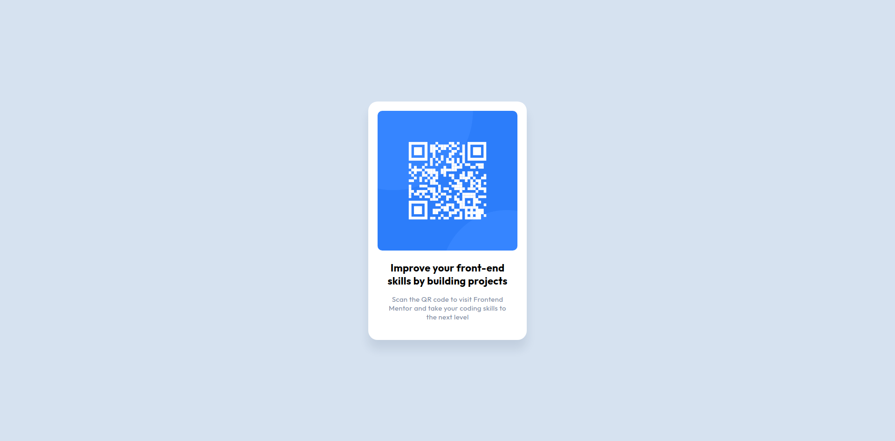

# Frontend Mentor - QR code component solution

This is a solution to the [QR code component challenge on Frontend Mentor](https://www.frontendmentor.io/challenges/qr-code-component-iux_sIO_H)

## Table of contents

- [Overview](#overview)
  - [Screenshot](#screenshot)
- [My process](#my-process)
  - [Built with](#built-with)
- [Author](#author)

## Overview

### Screenshot

- Solution URL: [Add solution URL here](https://github.com/markrajk/fm_01_qr_code_component)
- Live Site URL: [Add live site URL here](https://markrajk.github.io/fm_01_qr_code_component/)

## My process

### Built with

- SCSS

## Author

- Frontend Mentor - [@yourusername](https://www.frontendmentor.io/profile/markrajk)
